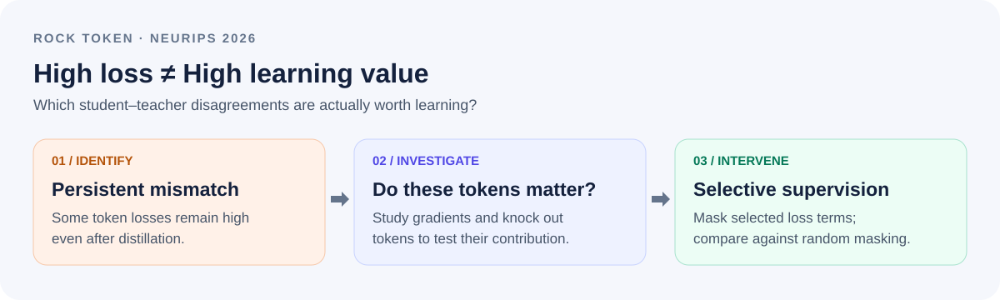
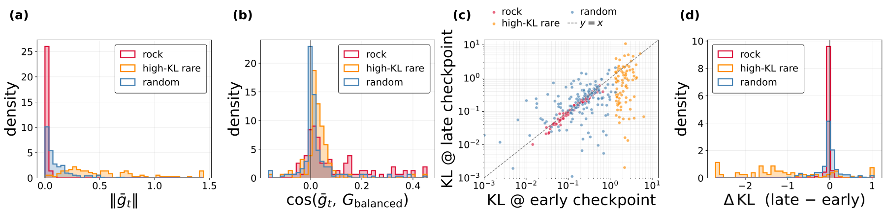
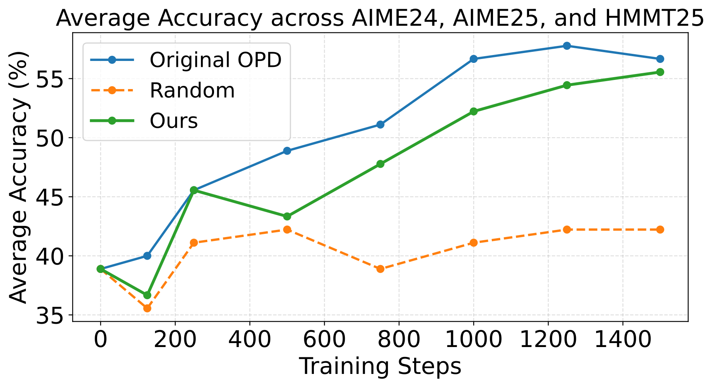

<div align="center">

# Rock Token
### Cornerstones or Stumbling Blocks?<br>Deciphering the Rock Tokens in On-Policy Distillation

**Yuxuan Jiang · Runchao Li · Shubhashis Roy Dipta · Dawei Li · Zhao Yang**

[](https://neurips.cc/Conferences/2026)
[](https://arxiv.org/abs/2605.09253)
[](https://arxiv.org/pdf/2605.09253)

**[Overview](#overview) · [Findings](#what-we-find) · [Code](#repository-guide) · [Getting started](#getting-started) · [Citation](#citation)**

</div>

## News

🎉 **Our paper has been accepted to NeurIPS 2026!**

The paper is available on [arXiv](https://arxiv.org/abs/2605.09253), with code for token analysis, distillation, and evaluation in this repository.

## Overview

> **High loss does not always mean high learning value.** We study persistent student–teacher disagreements in on-policy distillation and ask whether they are essential learning signals or low-return supervision.

In **on-policy distillation (OPD)**, a student generates its own responses and learns from a teacher's token-level predictions. Some tokens keep exhibiting high distillation loss even as training progresses. We call these **Rock Tokens**.

We investigate their persistence, test their functional contribution through token knock-out experiments, and examine what happens when their loss terms are selectively masked during training.

<p align="center">
  
</p>

## What we find

### 1. Persistent loss is not the same as useful progress

Rock Tokens retain student–teacher mismatch across checkpoints. Comparing their gradients and loss trajectories with rare high-KL tokens and random tokens helps distinguish persistent residuals from isolated high-loss events.

<p align="center">
  
</p>

*Gradient dynamics and checkpoint comparisons from the paper. The early-versus-late KL plot makes the persistence of Rock Tokens visible.*

### 2. Selective masking differs from randomly removing supervision

In the reported experiments, selectively masking Rock-token loss terms retains substantially more reasoning performance than frequency-matched random masking and approaches full OPD. This motivates allocating supervision according to its contribution, rather than treating every high-loss position as equally valuable.

<p align="center">
  
</p>

*Average accuracy across AIME24, AIME25, and HMMT25 during training. “Ours” denotes selective Rock-token loss masking. Masking loss terms does not remove tokens from the vocabulary or freeze model parameters.*

## Repository guide

| Directory | Purpose | Start here |
|---|---|---|
| [`rock_detection/`](rock_detection/) | Collect token-level KL statistics; identify Rock Tokens; analyze persistence, gradients, and selection stability | [Analysis guide](rock_detection/README.md) |
| [`KDFlow_localopd/`](KDFlow_localopd/) | KDFlow-based on-policy distillation training | [Framework setup](KDFlow_localopd/README.md), [launch script](KDFlow_localopd/run_localopd.sh) |
| [`stumbling/`](stumbling/) | Token-selective distillation and masking controls | [Masking implementation](stumbling/kdflow/algorithms/token_freeze_kd.py), [Rock-token IDs](stumbling/rock.json), [random-control IDs](stumbling/random.json) |
| [`evaluation/`](evaluation/) | Mathematical reasoning evaluation using lm-evaluation-harness | [Evaluation guide](evaluation/README.md) |

## Getting started

```bash
git clone https://github.com/YuxuanJiang1/Rock-Token.git
cd Rock-Token
```

**Analyze tokens.** Follow the [analysis guide](rock_detection/README.md) to collect per-token KL statistics, select token sets, compare checkpoints, and reproduce diagnostic plots. The default configuration uses a Qwen3-30B-A3B-Instruct teacher, Qwen3-4B student checkpoints, and MATH-500 prompts. Some configured checkpoints are private; obtain access or supply your own compatible checkpoint before running collection.

**Run distillation.** Use the [KDFlow setup instructions](KDFlow_localopd/README.md) and inspect the [OPD launch script](KDFlow_localopd/run_localopd.sh). The [`stumbling/`](stumbling/) variant implements selective loss masking. These are research launch configurations: adapt the Python/CUDA paths, model and dataset locations, GPU settings, and output directories to your environment. The launch scripts also restart Ray and terminate existing Ray/SGLang processes, so review those commands before using a shared machine. Token-ID lists must match the model's tokenizer.

**Evaluate a checkpoint.** Follow the [evaluation guide](evaluation/README.md). After installing its dependencies and setting `MODEL` in the script, run from the repository root:

```bash
bash evaluation/run_eval_vllm.sh
```

The evaluation scripts cover **AIME 2024, AIME 2025, and HMMT February 2025**, with answer extraction and exact-match scoring. See the guide for sampling settings and aggregation over three seeds.

## Citation

If you find this work useful, please cite the arXiv version below. The NeurIPS 2026 acceptance is announced above; this entry remains the preprint citation until proceedings metadata is available.

```bibtex
@misc{jiang2026rocktokens,
  title={Cornerstones or Stumbling Blocks? Deciphering the Rock Tokens in On-Policy Distillation},
  author={Yuxuan Jiang and Runchao Li and Shubhashis Roy Dipta and Dawei Li and Zhao Yang},
  year={2026},
  eprint={2605.09253},
  archivePrefix={arXiv},
  primaryClass={cs.CL},
  url={https://arxiv.org/abs/2605.09253}
}
```

## Acknowledgments

Our training code builds on [KDFlow](https://github.com/songmzhang/KDFlow), and evaluation uses [lm-evaluation-harness](https://github.com/EleutherAI/lm-evaluation-harness). The bundled framework directories retain their license files and upstream documentation.

For questions or reproducibility discussions, please [open an issue](https://github.com/YuxuanJiang1/Rock-Token/issues).
