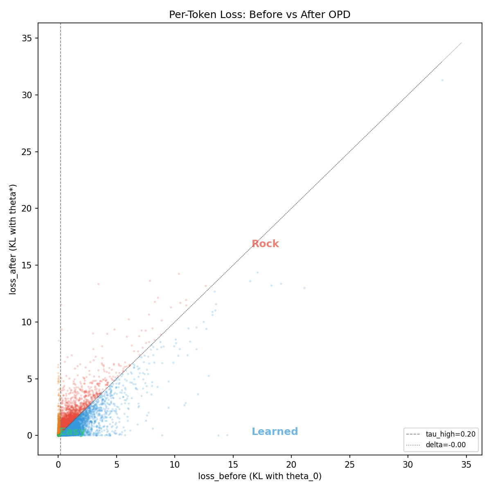
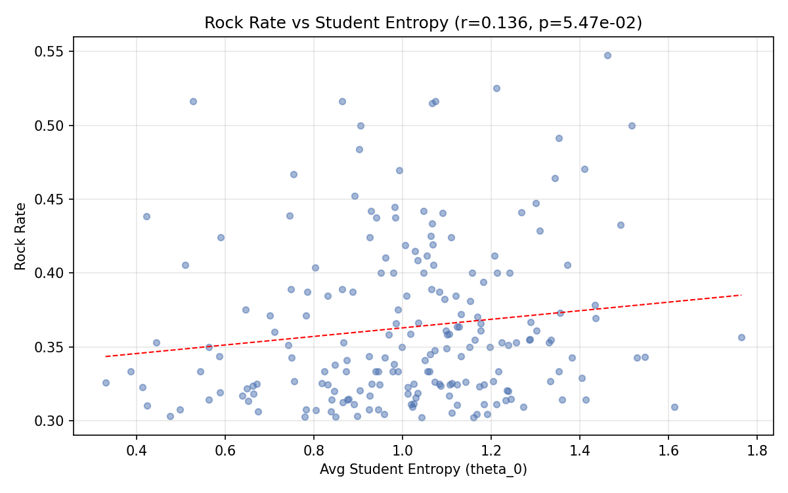

# Rock Token Identification — Part 1 Report

**Date:** 2026-04-26
**Authors:** Dipta, Chao, Zhao
**Pipeline version:** 0.4.0

---

## 1. Setup

### Models

| Role | Model | Params |
|------|-------|--------|
| Teacher | Qwen/Qwen3-30B-A3B-Instruct-2507 | 30B MoE (3B active) |
| Pre-OPD Student (θ₀) | Qwen/Qwen3-4B-Instruct-2507 | 4B |
| Post-OPD Student (θ\*) | RockToken/qwen3_30b_a3b_to_4b_onpolicy_5k_src20k-25k | 4B (distilled) |

### Prompt Set

1,500 prompts from 4 datasets (all train splits — zero overlap with evaluation benchmarks):

| Source | Count | Domain |
|--------|-------|--------|
| MATH (Hendrycks) | 500 | Competition math |
| GSM8K | 500 | Grade-school math |
| MBPP | 300 | Code generation |
| Alpaca | 200 | General instructions |

### Generation

- 3 sampled outputs per prompt at temperature=1.0 (not greedy)
- Max 16,384 tokens per output; truncated outputs discarded
- Total: **4,500 sequences** → **4,814,434 token positions** measured

---

## 2. Recalcitrance Criterion

A token instance is classified as **Rock** if it satisfies both conditions:

1. **High loss before training:** `KL(teacher ‖ θ₀) ≥ τ_high`
2. **Barely improved (or regressed):** `improvement < δ`, where `improvement = KL_before − KL_after`

### Threshold values (derived from data)

| Parameter | Percentile | Value | Interpretation |
|-----------|-----------|-------|----------------|
| τ\_high | 80th of loss\_before | **0.195** | Only the top 20% hardest tokens qualify |
| δ | 20th of improvement | **−0.0001** | Essentially zero — Rock tokens must have negative or near-zero improvement |

The δ threshold being ~0 is a key finding: **80% of high-loss tokens did improve after OPD**. Rock Tokens are the remaining 20% that didn't — and most of them actually got *worse* (negative improvement). This is genuine recalcitrance: the student not only failed to learn these tokens, but was pushed further from the teacher by training.

---

## 3. Rock Token Census

| Metric | Value |
|--------|-------|
| Total token positions | 4,814,434 |
| Rock instances | 296,657 |
| **Rock fraction** | **6.2%** |
| Unique Rock token types (freq ≥ 30) | 200 reported |

The 6.2% fraction is within the expected 5–20% range from the literature. This means the thresholds are well-calibrated — selective enough to be meaningful, inclusive enough to capture a real population.

---

## 4. Scatter Plot — Four-Quadrant Structure

The scatter plot of `loss_before` (x) vs `loss_after` (y) reveals clear quadrant structure:

- **Easy (green, near origin):** The vast majority of tokens. Low KL before and after — the student already matched the teacher on these.
- **Learned (blue, below diagonal):** High KL before training, low after. These are the OPD success stories — tokens where distillation worked.
- **Rock (red, above diagonal):** High KL before AND after. The student was bad and stayed bad — or got worse. These cluster above the identity line, meaning loss_after > loss_before.
- **Regressed (orange, upper-left):** Low KL before, higher after. The student was fine but got worse. A small but real population.

The clear separation between Learned (blue) and Rock (red) validates the recalcitrance criterion — these are genuinely different populations, not just noise in a continuous distribution.

---

## 5. Entropy Correlation — Rock Tokens ≠ Forking Tokens

| Statistic | Value |
|-----------|-------|
| Pearson r | 0.136 |
| p-value | 0.055 (not significant at α=0.05) |

There is **no significant correlation** between a token's Rock rate and its average student entropy. This is a critical finding for positioning the paper:

**Rock Tokens are NOT forking tokens.** Wang et al. (2025) identified "forking tokens" as high-entropy decision points where the model is uncertain. Our Rock Tokens exist across all entropy levels — some are high-entropy (the student is confused) and some are low-entropy (the student is confidently wrong). The phenomenon we're capturing is distinct from uncertainty-based token categories.

The weak positive trend (r=0.136) suggests a slight tendency for higher-entropy tokens to be more recalcitrant, but this is far from deterministic.

---

## 6. Two Rankings — Rate vs. Count

We report Rock Tokens with two complementary rankings, each answering a different question:

### 6a. Rate-Ranked (proportionally worst)

*"Which tokens does the student fail at most consistently?"*

| Rank | Token | Freq | Rock | Rate | KL₀ | KL\* | Δ |
|------|-------|------|------|------|-----|------|---|
| 1 | " little" | 42 | 23 | 54.8% | 0.88 | 1.02 | −0.14 |
| 2 | " flexible" | 40 | 21 | 52.5% | 1.33 | 1.38 | −0.05 |
| 3 | " Initialize" | 31 | 16 | 51.6% | 0.60 | 0.92 | −0.31 |
| 4 | " economic" | 31 | 16 | 51.6% | 0.89 | 1.04 | −0.15 |
| 5 | "Long" | 31 | 16 | 51.6% | 2.03 | 2.08 | −0.05 |
| 6 | " sun" | 33 | 17 | 51.5% | 1.21 | 1.30 | −0.09 |
| 7 | " scientific" | 30 | 15 | 50.0% | 0.90 | 0.92 | −0.02 |
| 8 | " fun" | 30 | 15 | 50.0% | 0.89 | 1.03 | −0.15 |
| 9 | " Consider" | 59 | 29 | 49.2% | 1.44 | 1.62 | −0.18 |
| 10 | " integration" | 31 | 15 | 48.4% | 0.66 | 0.81 | −0.15 |

These tokens are Rock in ~50% of their appearances. Nearly all have negative improvement (Δ < 0), meaning the student got *worse* at them after OPD.

### 6b. Count-Ranked (highest absolute impact)

*"Which tokens contribute the most rock instances — i.e., affect the most positions?"*

| Rank | Token | Freq | Rock | Rate | KL₀ | KL\* | Δ |
|------|-------|------|------|------|-----|------|---|
| 1 | **" Python"** | 1138 | 371 | 32.6% | 0.88 | 1.27 | −0.39 |
| 2 | **" It"** | 856 | 263 | 30.7% | 0.79 | 0.83 | −0.04 |
| 3 | " starting" | 400 | 123 | 30.8% | 0.49 | 0.53 | −0.03 |
| 4 | " Note" | 267 | 91 | 34.1% | 1.04 | 1.08 | −0.04 |
| 5 | " handle" | 259 | 83 | 32.0% | 0.89 | 0.85 | +0.04 |
| 6 | " However" | 264 | 83 | 31.4% | 0.84 | 0.77 | +0.08 |
| 7 | " assumes" | 200 | 69 | 34.5% | 1.03 | 1.03 | −0.00 |
| 8 | " clean" | 215 | 65 | 30.2% | 0.93 | 0.94 | −0.00 |
| 9 | " ensures" | 149 | 57 | 38.3% | 0.74 | 0.81 | −0.07 |
| 10 | " fix" | 144 | 52 | 36.1% | 0.50 | 0.53 | −0.03 |

**" Python" dominates with 371 rock instances** — 3× the second-ranked token. This likely reflects the student being trained primarily on math (OPD with math prompts) while struggling with code-related vocabulary.

### Why both rankings matter

The count-ranked list is more actionable for Part 2 (masking experiments), because:
- High-frequency tokens appear in many evaluation samples → measurable benchmark effects
- Masking " Python" (1138 occurrences) will visibly affect code benchmarks
- Masking " little" (42 occurrences) may produce noisy results

The rate-ranked list tells us about the *nature* of recalcitrance: which tokens are most consistently problematic, independent of how often they appear.

---

## 7. Qualitative Token Categories

Inspecting the full 200 Rock Tokens, we observe several semantic clusters:

| Category | Examples | Interpretation |
|----------|----------|----------------|
| **Code/technical** | " Python", " Initialize", " fix", " clean", " handle", " Algorithm" | Student trained on math, struggles with code vocabulary |
| **Reasoning connectives** | " However", " Consider", " Note", " assumes", " ensures" | Discourse markers that structure chain-of-thought — the student misaligns on *how* to reason, not just *what* to reason about |
| **General content words** | " little", " flexible", " sun", " economic", " fun" | No obvious domain — suggests some vocabulary items are intrinsically harder for the 4B student to align with the 30B teacher |
| **Formatting/structure** | "Long", " explicit", " pad", "roots" | Tokens involved in output structure |

The code/technical cluster is notable: the OPD training used 5K math prompts, so the student improved on math tokens but made no progress (or regressed) on code tokens that appear in mixed-domain generation.

---

## 8. Key Takeaway: Most Rock Tokens Regressed

A surprising finding: the majority of top Rock Tokens have **negative improvement** — their KL divergence with the teacher actually *increased* after OPD training. This means on-policy distillation doesn't just fail to help on these tokens; it actively pushes the student *away* from the teacher.

This has direct implications for Part 2: if these tokens are Stumbling Blocks (masking them helps), it suggests that the OPD loss on these positions generates harmful gradients. If they're Pillars (masking hurts), it means the student is learning something useful despite the superficial KL increase.

---

## 9. Limitations

1. **Single distillation run.** Results are from one OPD checkpoint. Repeating with different seeds would strengthen the claims.
2. **Rate estimates at moderate frequencies.** Top rate-ranked tokens have 30–60 occurrences. Reliable, but not as stable as the count-ranked tokens (100+).
3. **Approximate KL in Phase 2.** The optimized pipeline uses top-256 teacher log-probs cached in RAM. This is >99.99% accurate but not exact.
4. **Mixed prompt domains.** Rock Token identity may be partially driven by domain mismatch (math-trained student evaluated on code prompts) rather than intrinsic token difficulty.

---

## 10. Next Steps (Part 2)

With 200 Rock Tokens identified, the next phase is **causal intervention via masking experiments** to determine which are Pillars and which are Stumbling Blocks:

1. **Baseline evaluation** — Run GSM8K, MMLU, HumanEval, IF-Eval on the unmasked student
2. **Individual knockout** — Mask each Rock Token (logit → −∞) one at a time, re-evaluate
3. **Cumulative removal curves** — Greedy removal by count rank, measure when performance crashes
4. **Group masking** — Remove entire semantic categories (code tokens, reasoning connectives, etc.)

The count-ranked list is the primary input for Part 2, as these tokens have enough frequency to produce measurable benchmark effects.

---

*Full data: `rock_tokens_by_rate.csv`, `rock_tokens_by_count.csv`*
*Plots: `scatter_loss.png`, `entropy_correlation.png`*
*Pipeline config: `config.yaml` at project root*
